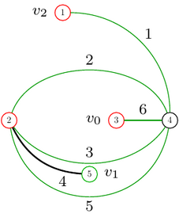

# Lopsp Tools
This repository contains various programs for working with lopsp-operations. 

## Programs 
* `apply_lopsp` applies one or more lopsp-operations to one or more embedded graphs. Run it with `-h` for details about its usage.
* `lopspgen` generates all lopsp-operations of a certain inflation factor. It takes many different options. Run it with `-h` for details about its usage.
* `read_planarcode` reads embedded graphs in planarcode from `stdin` and outputs them in a readable text format to `stdout`. For each vertex of the graph its incident vertices are listed in the order of the embedding. 
* `read_edgecode` reads embedded graphs in edgecode from `stdin` and outputs them in a readable text format to `stdout`. For each vertex of the graph its incident edges are listed in the order of the embedding. Every edge is represented by a unique number. As every edge is incident with two vertices, each of these edge numbers appears twice in the lists of incident edges.
* `read_lopsp` reads lopsp-operations in `.lopsp` format from `stdin`and outputs them in a readable text format to `stdout`. For each lopsp-operation, first the numbers of $v_0$, $v_1$ and $v_2$ are given. Then for every vertex, its neighbouring vertices are listed in the order of the embedding. The type of a vertex is given between parentheses `()`. Note that this is more similar to planarcode than to edgecode, even though double edges are possible. This is not a problem as a lopsp-operation is always a plane triangulation. In that case there is a unique way to interpret the planarcode. 
* `txt_to_planar.py` is a python script to create planarcode from a readable text format. Examples of this format can be found in `examples/txt_for_planarcode`. For every vertex there is a line starting with the number of this vertex, and then all of its neighbours are listed in clockwise order. To use this script to make planarcode from the `examples/txt_for_planarcode/tetrahedron.txt` file and store it in `examples/planarcode/tetrahedron.pl`, run for example: 
```
python3 txt_to_planar.py < examples/txt_for_planarcode/tetrahedron.txt > examples/planarcode/test.pl
```
* `txt_to_edge.py` is a python script to create edgecode from a readable text format. It works the same way as `txt_to_planar.py`, but it uses a different text format. Examples of this format can be found in `examples/txt_for_edgecode`. Again, every line starts with a number representing a vertex. However, the following numbers do not represent vertices, but edges. Every edge is represented by a unique number, and therefore occurs twice in the file. Numbers can occur three times, but one of those occurrences is at the beginning of a line, where the number represents a vertex and not an edge.
* `txt_to_lopsp` reads a lopsp-operation in a readable text format from `stdin` and outputs that lopsp-operation in `.lopsp` format to `stdout`. The expected txt format is as follows. 

	First the number $n$ of vertices of the lopsp-operation is given. This is followed by one line for every vertex 	(numbered 1 through $n$). Such a line consists of the number of the vertex, followed by parentheses `()`. These contain the type (0, 1 or 2) of the vertex and if the vertex is $v_0$, $v_1$ or $v_2$ this is also indicated. Then follows a colon `:` and the neighbours of the vertex separated by spaces. The neighbours are given in the order of the embedding. An example for the operation gyro: 
	   
	```
	7  
	1(0,v2):2 6  
	2(1):1 6 3 6  
	3(0):2 6 4 7 6  
	4(1):3 6 5 6  
	5(0,v0):4 6  
	6(2):5 4 3 2 1 2 3 7 4  
	7(1,v1):3 6
	```

* `decocode_to_lopsp` reads lsp-operations in decocode from `stdin` and outputs the equivalent lopsp-operations in `.lopsp` format to `stdout`. Decocode is the output format of the lsp generator at https://github.com/314eter/decogen. 

## Compilation and examples
To compile all the C programs in this repository, run `make all` in the main directory. Some examples of how the programs can be used: 

* Converting `examples/txt_for_planarcode/tetrahedron.txt` to planarcode and storing it in `examples/planarcode/tetrahedron.pl`. 
```
python3 txt_to_planar.py < examples/txt_for_planarcode/tetrahedron.txt > examples/planarcode/tetrahedron.pl
```

* Generating all lopsp-operations of inflation factor at most 4, applying them to the tetrahedron and converting the result to a readable format.
```
./lopspgen -a 4 | ./apply_lopsp -g examples/planarcode/tetrahedron.pl | ./read_edgecode
```

* Converting `examples/txt_for_edgecode/octahedron_edge.txt` to edgecode and applying the operation ambo to it, with the result given in planarcode.
```
python3 txt_to_edge.py < examples/txt_for_edgecode/octahedron_edge.txt | ./apply_lopsp -p -o examples/lopsp/ambo.lopsp | ./read_planarcode
```

## Data formats

* The planarcode format is a widely used format to encode **simple** embedded graphs, so embedding graphs that do not have loops or double edges. Contrary to what the name suggests, embeddings that are not plane can also be encoded in this format. A file containing embedded graphs in planarcode starts with the header `>>planar_code<<`. More info about this format can be found [here](https://houseofgraphs.org/help#format_pc).

* The edgecode format is less common than planarcode, but it can be used for all embedded graphs, not just simple ones. A file containing embedded graphs in edgecode starts with the header `>>edge_code<<`. More info about this format can be found [here](https://users.cecs.anu.edu.au/~bdm/plantri/plantri-guide.txt)

* The `.lopsp` format is a memory-efficient format to encode lopsp-operations. As every type 1 vertex of a lopsp-operation $O$ that is different from $v_1$ has degree 4, we can remove it from the operation without losing information. If $v_1$ has type 1 we also remove one of its two edges. The resulting labeled embedded graph $O'$ (which is a plane quadrangulation) is what we will encode. A file containing lopsp-operations in `.lopsp` format starts with the header `>>lopsp<<`. Then follows the number of vertices in $O'$ and three unsigned shorts containing the numbers of the vertices  $v_0$, $v_1$ and $v_2$ in that order. After that there is another unsigned short, which is 0 if $v_0$ is of type 0 and 2 if $v_0$ is of type 2. Then another, which is 0 if $v_1$ is not of type 1 and 1 if it is. The types of these vertices determine the types of all other vertices in $O'$. Finally for every vertex its incident edges (every edge has a  unique number) are given in the order of the embedding, followed by a 0. Every number here is an unsigned short (2 bytes). An example of the .lopsp-format for gyro:  

```  
>>lopsp<<53510110234506062153040
```




